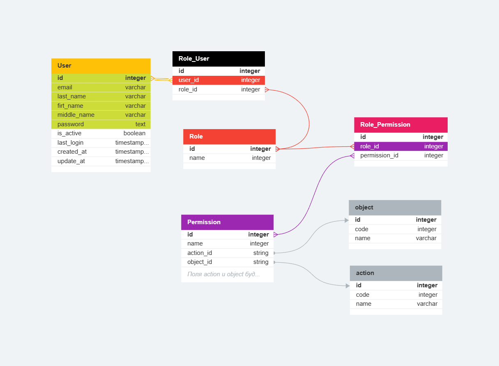

# Архитектура

---

## Backend

---

### DataBase



---

### Основные сущности

#### Пользователь

Описывает стандартного пользователя системы

| Название поля                 | Ссылается на | Тип ключа | Тип данных   | Описание                                       | Значение по умолчанию |
| ----------------------------- | ------------ | --------- | ------------ | ---------------------------------------------- | --------------------- |
| <a id="user_id"></a>id        |              | PK        | int          | (unique) идентификатор                         |                       |
| <a id="email"></a>email       |              |           | varchar(255) | (unique) email пользователя                    |                       |
| <a id="password"></a>password |              |           | string       | пароль пользователя                            |                       |
| last_name                     |              |           | varchar(255) | (nullable) фамилия пользователя                |                       |
| first_name                    |              |           | varchar(255) | (nullable) имя пользователя                    |                       |
| middle_name                   |              |           | varchar(255) | (nullable) отчество пользователя               |                       |
| is_active                     |              |           | boolean      | ключ активности учетной записи                 | false                  |
| last_login                    |              |           | timestampz   | время последнего входа в систему               |                       |
| created_at                    |              |           | timestampz   | время создание учетной записи                  |                       |
| updated_at                    |              |           | timestampz   | время последнего редактирования учетной записи |                       |

#### Роль

Описывает стандартную роль системы

| Название поля | Ссылается на | Тип ключа | Тип данных   | Описание                       | Значение по умолчанию |
| ------------- | ------------ | --------- | ------------ | ------------------------------ | --------------------- |
| id            |              | PK        | int          | (unique) идентификатор         |                       |
| name          |              |           | varchar(255) | человекочитаемое название роли |                       |

#### Право

Описывает стандартное право системы

| Название поля | Ссылается на      | Тип ключа | Тип данных   | Описание                          | Значение по умолчанию |
| ------------- | ----------------- | --------- | ------------ | --------------------------------- | --------------------- |
| id            |                   | PK        | int          | (unique) идентификатор            |                       |
| name          |                   |           | varchar(255) | человекочитаемое название роли    |                       |
| action_id     | [action](#action) | FK        | int          | действие, производимое над object |                       |
| object_id     | [object](#object) | FK        | int          | объект доступа                    |                       |

#### <a id="object"></a>Объект доступа

Описывает стандартный объект доступа системы. Объект системы создается для идентификации классов системы, чтобы определять права доступа к определенному функционалу системы. Является справочным объектом и не изменяется с помощью запросов. Создается на этапе проектирования

| Название поля | Ссылается на | Тип ключа | Тип данных   | Описание                          | Значение по умолчанию |
| ------------- | ------------ | --------- | ------------ | --------------------------------- | --------------------- |
| id            |              | PK        | int          | (unique) Идентификатор            |                       |
| name          |              |           | varchar(255) | человекочитаемое название объекта |                       |
| code          |              |           | int          | Машинночитаемое название объекта  |                       |

#### <a id="action"></a>Действие над объектом доступа

Описывает стандартный действие над объектом доступа доступа системы. Действие системы создается для идентификации методов объектов системы, чтобы определять права доступа к определенному функционалу системы. Является справочным объектом и не изменяется с помощью запросов. Создает на этапе проектирования

| Название поля | Ссылается на | Тип ключа | Тип данных   | Описание                           | Значение по умолчанию |
| ------------- | ------------ | --------- | ------------ | ---------------------------------- | --------------------- |
| id            |              | PK        | int          | (unique) Идентификатор             |                       |
| name          |              |           | varchar(255) | человекочитаемое название действия |                       |
| code          |              |           | int          | Машинночитаеоме название действия  |                       |

---

### Функции системы

1. Авторизация пользователя:

   Авторизация пользователя представляет через Token Based Authentication, который обычно применяется при построении систем Single sign-on (SSO). При его использовании запрашиваемый сервис делегирует функцию проверки достоверности сведений о пользователе другому сервису.

   1. Терминология

   #### Клиент

   Client — устройство или программа (браузер, приложение), которым требуется либо токен для аутентификации пользователя, либо токен для доступа к какому-то ресурсу

   #### Пользователь

   User — собственно конечный пользователь — человек.

   #### Область

   Scope — идентификатор ресурса, к которому клиент хочет получить доступ.

   Области бывают двух видов:

   Identity scopes — это запрос информации о пользователе. Его имя, профиль, пол, фотография, адрес электронной почты и так далее.

   Resource scopes — имена внешних ресурсо (Web APIs), к которым клиент хочет получить доступ.

   #### Запрос на аунтефикацию

   Authentication/Token Request — процесс запроса аутентификации.

   #### <a id="identity"></a>Токен личности

   Identity Token — подтверждение аутентификации. Этот токен содержит минимальный набор информации о пользователе.

   #### <a id="access"></a>Токен доступа

   Access Token — информация, что конкретному пользователю разрешается делать. Клиент запрашивает Access Token и затем использует его для доступа к ресурсам (Web APIs). Access Token содержит информацию о клиенте и пользователе, если она присутствует.

   #### <a id="refresh"></a>Токен обновления

   Refresh Token — токен, по которому сервис вернет новый Access Token.

   2. Этапы
      1. Пользователь обращается к системе
      2. Контроллер приложения перенаправляет запрос в класс представления
      3. Класс представления обращается к сервису авторизация
         1. Производится идентификация пользователя (метод определения, что за пользователь обращается к системе). Если пользователь есть в системе обращается к 2 пункту, в ином случае происходит ошибка.
         2. Производится аунтификация пользователя (метод определения, что пользователь является тем, за кого себя выдает). Если пользователь ввел данные верно обращаемся к 3 пункту, в ином случае происходит ошибка.
         3. Производится авторизация пользователя (метод принятия решение о том, что можно делать данному пользователю системы).
         4. Происходит генерация токенов.
      4. Класс представление возвращает ответ пользователю
   3. Конечные методы

      1. POST /api/v1/auth/authorize

         Используется для авторизации пользователя по **[email](#email)** и **[password](#password)**

         Тело запроса:
         | Поле | Тип | Описание |
         |---------- |-------- |--------------------- |
         | [email](#email) | string | email пользователя |
         | [password](#password) | string | пароль пользователя |

         Схема:

         ```json
         {
             email: string,
             password: string,
         }
         ```

         Тело ответа:

         1. Успешный запрос

            | Поле                  | Тип    | Описание                                          |
            | --------------------- | ------ | ------------------------------------------------- |
            | [identity](#identity) | string | токен личности в формате [JWT](https://jwt.io/)   |
            | [refresh](#refresh)   | string | токен обновления в формате [JWT](https://jwt.io/) |
            | [access](#access)     | string | токен доступа в формате [JWT](https://jwt.io/)    |

            Схема:

            ```json
            {
                identity: string,
                refresh: string,
                access: string,
            }
            ```

         2. Неуспешный запрос

            | Поле    | Тип    | Описание                          |
            | ------- | ------ | --------------------------------- |
            | code    | int    | код ошибки                        |
            | message | string | человекочитаемое сообщение ошибки |

            Схема:

            ```json
            {
                code: number,
                message: string,
            }
            ```

      2. POST /api/v1/auth/refresh

         Используется для получения новой тройки токенов

         Тело запроса:

         | Поле                | Тип    | Описание      |
         | ------------------- | ------ | ------------- |
         | [refresh](#refresh) | string | refresh токен |

         Тело ответа:

         1. Успешный запрос:

            | Поле                  | Тип    | Описание                                          |
            | --------------------- | ------ | ------------------------------------------------- |
            | [identity](#identity) | string | токен личности в формате [JWT](https://jwt.io/)   |
            | [refresh](#refresh)   | string | токен обновления в формате [JWT](https://jwt.io/) |
            | [access](#access)     | string | токен доступа в формате [JWT](https://jwt.io/)    |

            Схема:

            ```json
            {
                identity: string,
                refresh: string,
                access: string,
            }
            ```

         2. Неуспешный запрос

            | Поле    | Тип    | Описание                          |
            | ------- | ------ | --------------------------------- |
            | code    | int    | код ошибки                        |
            | message | string | человекочитаемое сообщение ошибки |

            Схема:

            ```json
            {
                code: number,
                message: string,
            }
            ```

2. Регистрация пользователя:

   Регистраиця пользователя производится только пользователями с определенными правами ("user_create").

   1. Терминология

      Users - таблица в базе данных, содержащая всех пользователей системы

   2. Этапы

      1. Пользователь обращается к системе
      2. Контроллер приложения перенаправляет запрос в класс представления
      3. Класс представления обращается к сервису регистрации
         1. Проверяется, есть ли права у пользователя на регистрацию нового пользователя в системе. Если прав достаточно, то обращаемся к пункту 2, в ином случае происходит ошибка.
         2. В таблице **Users** создается запись с новым пользователем
      4. Класс представление возвращает ответ пользователю

   3. Конечные методы

      1. POST /api/v1/registration/register

         Используется для регистрации новых пользователей

         Тело запроса:

         | Поле        | Тип    | Описание                         |
         | ----------- | ------ | -------------------------------- |
         | email       | string | email пользователя               |
         | password    | string | пароль пользователя              |
         | last_name   | string | (nullable) фамилия пользователя  |
         | first_name  | string | (nullable) имя пользователя      |
         | middle_name | string | (nullable) отчество пользователя |

         Схема:

         ```json
         {
            email: string,
            password: string,
            last_name: string | null,
            first_name: string | null,
            middle_name: string | null,
         }
         ```

         Тело ответа:

         1. Успешный запрос:

            Тело отсутсвуте

         2. Неуспешный запрос

            | Поле    | Тип    | Описание                          |
            | ------- | ------ | --------------------------------- |
            | code    | int    | код ошибки                        |
            | message | string | человекочитаемое сообщение ошибки |

            Схема:

            ```json
            {
                code: number,
                message: string,
            }
            ```

3. Редактирование данных пользовотеля

   Редактирование пользователя производится только пользователями с определенными правами ("user_edit").

   1. Терминология

      Users - таблица в базе данных, содержащая всех пользователей системы

   2. Этапы
      1. Пользователь обращается к системе
      2. Контроллер приложения перенаправляет запрос в класс представления
      3. Класс представления обращается к сервису пользователей
         1. Проверяется, есть ли права у пользователя на изменение данных о пользователе в системе. Если прав достаточно, то обращаемся к пункту 2, в ином случае происходит ошибка.
         2. В таблице **Users** изменяется пользователь.
      4. Класс представление возвращает ответ пользователю
   3. Конечные методы

      1. PATCH /api/v1/user/{user_id}/

         Параметры запроса:

         | Поле                | Тип | Описание                   |
         | ------------------- | --- | -------------------------- |
         | [user_id](#user_id) | int | идентификатор пользователя |

         Тело запроса:

         | Поле        | Тип    | Описание                         |
         | ----------- | ------ | -------------------------------- |
         | email       | string | email пользователя               |
         | password    | string | пароль пользователя              |
         | last_name   | string | (nullable) фамилия пользователя  |
         | first_name  | string | (nullable) имя пользователя      |
         | middle_name | string | (nullable) отчество пользователя |

         Схема:

         ```json
         {
            email: string,
            password: string,
            last_name: string | null,
            first_name: string | null,
            middle_name: string | null,
         }
         ```

         Тело ответа:

         1. Успешный запрос:

            | Поле        | Тип        | Описание                                       |
            | ----------- | ---------- | ---------------------------------------------- |
            | id          | int        | идентификатор                                  |
            | email       | string     | email пользователя                             |
            | last_name   | string     | (nullable) фамилия пользователя                |
            | first_name  | string     | (nullable) имя пользователя                    |
            | middle_name | string     | (nullable) отчество пользователя               |
            | is_active   | boolean    | ключ активности учетной записи                 |
            | last_login  | timestampz | время последнего входа в систему               |
            | created_at  | timestampz | время создание учетной записи                  |
            | updated_at  | timestampz | время последнего редактирования учетной записи |

            Схема:

            ```json
            {
                id: int,
                email: string,
                last_name: string | null,
                first_name: string | null,
                middle_name: string | null,
                is_active: boolean,
                last_login: string,
                created_at: string,
                updated_at: string,
            }
            ```

         2. Неуспешный запрос

            | Поле    | Тип    | Описание                          |
            | ------- | ------ | --------------------------------- |
            | code    | int    | код ошибки                        |
            | message | string | человекочитаемое сообщение ошибки |

            Схема:

            ```json
            {
                code: number,
                message: string,
            }
            ```

4. Удаления пользовотеля

   Удаление пользователя производится только пользователями с определенными правами ("user_delete").

   1. Терминология

      Users - таблица в базе данных, содержащая всех пользователей системы

   2. Этапы
      1. Пользователь обращается к системе
      2. Контроллер приложения перенаправляет запрос в класс представления
      3. Класс представления обращается к сервису пользователей
         1. Проверяется, есть ли права у пользователя на удаление пользователя из системы. Если прав достаточно, то обращаемся к пункту 2, в ином случае происходит ошибка.
         2. Из таблицы **Users** удаляется пользователь.
      4. Класс представление возвращает ответ пользователю
   3. Конечные методы

      1. DELETE /api/v1/user/{user_id}

         Используется для удаления пользователя из системы

         Параметры запроса:

         | Поле                | Тип | Описание                   |
         | ------------------- | --- | -------------------------- |
         | [user_id](#user_id) | int | идентификатор пользователя |

         Тело ответа:

         1. Успешный запрос:

            Тело отсутсвуте

         2. Неуспешный запрос

            | Поле    | Тип    | Описание                          |
            | ------- | ------ | --------------------------------- |
            | code    | int    | код ошибки                        |
            | message | string | человекочитаемое сообщение ошибки |

            Схема:

            ```json
            {
                code: number,
                message: string,
            }
            ```

5. Чтение данных пользователей

   Чтение данных пользователя производится только пользователями с определенными правами ("user_read").

   1. Терминология

      Users - таблица в базе данных, содержащая всех пользователей системы

   2. Этапы
      1. Пользователь обращается к системе
      2. Контроллер приложения перенаправляет запрос в класс представления
      3. Класс представления обращается к сервису пользователей
         1. Проверяется, есть ли права у пользователя на удаление пользователя из системы. Если прав достаточно, то обращаемся к пункту 2, в ином случае происходит ошибка.
         2. Из таблицы **Users** достается пользователь.
      4. Класс представление возвращает ответ пользователю
   3. Конечные методы

      1. GET /api/v1/user/{user_id}

         Используется для чтения пользователя по уникальному идентификатору

         Параметры запроса:

         | Поле                | Тип | Описание                   |
         | ------------------- | --- | -------------------------- |
         | [user_id](#user_id) | int | идентификатор пользователя |

         Тело ответа:

         1. Успешный запрос:

            | Поле        | Тип        | Описание                                       |
            | ----------- | ---------- | ---------------------------------------------- |
            | id          | int        | идентификатор                                  |
            | email       | string     | email пользователя                             |
            | last_name   | string     | (nullable) фамилия пользователя                |
            | first_name  | string     | (nullable) имя пользователя                    |
            | middle_name | string     | (nullable) отчество пользователя               |
            | is_active   | boolean    | ключ активности учетной записи                 |
            | last_login  | timestampz | время последнего входа в систему               |
            | created_at  | timestampz | время создание учетной записи                  |
            | updated_at  | timestampz | время последнего редактирования учетной записи |

            Схема:

            ```json
            {
                id: int,
                email: string,
                last_name: string | null,
                first_name: string | null,
                middle_name: string | null,
                is_active: boolean,
                last_login: string,
                created_at: string,
                updated_at: string,
            }
            ```

         2. Неуспешный запрос

            | Поле    | Тип    | Описание                          |
            | ------- | ------ | --------------------------------- |
            | code    | int    | код ошибки                        |
            | message | string | человекочитаемое сообщение ошибки |

            Схема:

            ```json
            {
                code: number,
                message: string,
            }
            ```

      2. GET /api/v1/users/

         Используется для чтения всех пользователей в системе

         1. Успешный запрос:

            | Поле           | Тип    | Описание                |
            | -------------- | ------ | ----------------------- |
            | page           | int    | номер страницы          |
            | total_elements | int    | общее количество данных |
            | data           | User[] | Список пользователей    |

            Схема:

            ```json
            {
                page: int,
                total_elements: int,
                data: User[],
            }
            ```

         2. Неуспешный запрос

            | Поле    | Тип    | Описание                          |
            | ------- | ------ | --------------------------------- |
            | code    | int    | код ошибки                        |
            | message | string | человекочитаемое сообщение ошибки |

            Схема:

            ```json
            {
                code: number,
                message: string,
            }
            ```

6. Добавление прав

   Добавление прав производится только пользователями с определенными правами ("permission_create").

   1. Терминология

      Permissions - таблица в базе данных, содержащая все права системы

      Permission - право, которое описывает доступы пользователя к функционалу системы

   2. Этапы
      1. Пользователь обращается к системе
      2. Контроллер приложения перенаправляет запрос в класс представления
      3. Класс представления обращается к сервису прав
         1. Проверяется, есть ли права у пользователя на создание Permisson. Если прав достаточно, то обращаемся к пункту 2, в ином случае происходит ошибка.
         2. В таблице **Permissions** создается Permission.
      4. Класс представление возвращает ответ пользователю
   3. Конечные методы

      1. POST /api/v1/permissions/

         Испоользуется для добавления прав в систему

         Тело запроса:

         | Поле | Тип    | Описание                           |
         | ---- | ------ | ---------------------------------- |
         | code | int    | человекочитаемое название действия |
         | name | string | машиночитаемое название действия   |

         Схема:

         ```json
         {
             code: int,
             name: string,
         }
         ```

         1. Успешный запрос:

            Тело отсутсвуте

         2. Неуспешный запрос

            | Поле    | Тип    | Описание                          |
            | ------- | ------ | --------------------------------- |
            | code    | int    | код ошибки                        |
            | message | string | человекочитаемое сообщение ошибки |

            Схема:

            ```json
            {
                code: number,
                message: string,
            }
            ```

7. Обновление прав

   Изменение прав производится только пользователями с определенными правами ("permission_update").

   Тело запроса:

   1. Терминология

      Permissions - таблица в базе данных, содержащая все права системы

      Permission - право, которое описывает доступы пользователя к функционалу системы

   2. Этапы
      1. Пользователь обращается к системе
      2. Контроллер приложения перенаправляет запрос в класс представления
      3. Класс представления обращается к сервису прав
         1. Проверяется, есть ли права у пользователя на создание Permisson. Если прав достаточно, то обращаемся к пункту 2, в ином случае происходит ошибка.
         2. В таблице **Permissions** изменяется Permission с определенным идентификатором.
      4. Класс представление возвращает ответ пользователю
   3. Конечные методы

      1. PATCH /api/v1/permissions/{permission_id}

         Испоользуется для изменения прав в систему

         Параметры запроса:

         | Поле          | Тип | Описание            |
         | ------------- | --- | ------------------- |
         | permission_id | int | идентификатор права |

         Тело запроса:

         | Поле | Тип    | Описание                           |
         | ---- | ------ | ---------------------------------- |
         | code | int    | человекочитаемое название действия |
         | name | string | машиночитаемое название действия   |

         Схема:

         ```json
         {
             code: int,
             name: string,
         }
         ```

         1. Успешный запрос:

            | Поле | Тип    | Описание                        |
            | ---- | ------ | ------------------------------- |
            | id   | int    | идентификатор права             |
            | code | int    | человекочитаемое название права |
            | name | string | машиночитаемое название права   |

            Схема:

            ```json
            {
                id: int,
                code: int,
                name: string,
            }
            ```

         2. Неуспешный запрос

            | Поле    | Тип    | Описание                          |
            | ------- | ------ | --------------------------------- |
            | code    | int    | код ошибки                        |
            | message | string | человекочитаемое сообщение ошибки |

            Схема:

            ```json
            {
                code: number,
                message: string,
            }
            ```

8. Удаление прав

   Получение прав производится только пользователями с определенными правами ("permission_delete").

   Тело запроса:

   1. Терминология

      Permissions - таблица в базе данных, содержащая все права системы

      Permission - право, которое описывает доступы пользователя к функционалу системы

   2. Этапы
      1. Пользователь обращается к системе
      2. Контроллер приложения перенаправляет запрос в класс представления
      3. Класс представления обращается к сервису прав
         1. Проверяется, есть ли права у пользователя на создание Permisson. Если прав достаточно, то обращаемся к пункту 2, в ином случае происходит ошибка.
         2. Из таблицы **Permissions** удаляется Permission.
      4. Класс представление возвращает ответ пользователю
   3. Конечные методы

      1. DELETE /api/v1/permissions/{permission_id}

         Испоользуется для удаление прав по определенному идентификатору

         Параметры запроса:

         | Поле          | Тип | Описание            |
         | ------------- | --- | ------------------- |
         | permission_id | int | идентификатор права |

         1. Успешный запрос:

            Тело отсутствует

         2. Неуспешный запрос

            | Поле    | Тип    | Описание                          |
            | ------- | ------ | --------------------------------- |
            | code    | int    | код ошибки                        |
            | message | string | человекочитаемое сообщение ошибки |

            Схема:

            ```json
            {
                code: number,
                message: string,
            }
            ```

9. Получение прав

   Получение прав производится только пользователями с определенными правами ("permission_read").

   Тело запроса:

   1. Терминология

      Permissions - таблица в базе данных, содержащая все права системы

      Permission - право, которое описывает доступы пользователя к функционалу системы

   2. Этапы
      1. Пользователь обращается к системе
      2. Контроллер приложения перенаправляет запрос в класс представления
      3. Класс представления обращается к сервису прав
         1. Проверяется, есть ли права у пользователя на создание Permisson. Если прав достаточно, то обращаемся к пункту 2, в ином случае происходит ошибка.
         2. Из таблицы **Permissions** получаем Permission.
      4. Класс представление возвращает ответ пользователю
   3. Конечные методы

      1. GET /api/v1/permissions/{permission_id}

         Испоользуется для получения прав по определенному идентификатору

         Параметры запроса:

         | Поле          | Тип | Описание            |
         | ------------- | --- | ------------------- |
         | permission_id | int | идентификатор права |

         1. Успешный запрос:

            | Поле | Тип    | Описание                        |
            | ---- | ------ | ------------------------------- |
            | id   | int    | идентификатор права             |
            | code | int    | человекочитаемое название права |
            | name | string | машиночитаемое название права   |

            Схема:

            ```json
            {
                id: int,
                code: int,
                name: string,
            }
            ```

         2. Неуспешный запрос

            | Поле    | Тип    | Описание                          |
            | ------- | ------ | --------------------------------- |
            | code    | int    | код ошибки                        |
            | message | string | человекочитаемое сообщение ошибки |

            Схема:

            ```json
            {
                code: number,
                message: string,
            }
            ```

      2. GET /api/v1/permissions/

         Испоользуется для получения всех прав

         1. Успешный запрос:

            | Поле           | Тип          | Описание                |
            | -------------- | ------------ | ----------------------- |
            | page           | int          | номер страницы          |
            | total_elements | int          | общее количество данных |
            | data           | Permission[] | Список пользователей    |

            Схема:

            ```json
            {
                page: int,
                total_elements: int,
                data: Permission[],
            }
            ```

         2. Неуспешный запрос

            | Поле    | Тип    | Описание                          |
            | ------- | ------ | --------------------------------- |
            | code    | int    | код ошибки                        |
            | message | string | человекочитаемое сообщение ошибки |

            Схема:

            ```json
            {
                code: number,
                message: string,
            }
            ```

10. Добавление ролей 

    Добавление ролей производится только пользователями с определенными правами ("role_create").

    1. Терминология

        Roles - таблица в базе данных, содержащая все роли системы

        Role - роль, которая содержит определенный список прав

        Permission - право, которое описывает доступы пользователя к функционалу системы

    2. Этапы
        1. Пользователь обращается к системе
        2. Контроллер приложения перенаправляет запрос в класс представления
        3. Класс представления обращается к сервису ролей
            1. Проверяется, есть ли права у пользователя на чтение Permission. Если прав достаточно, то обращаемся к пункту 2, в ином случае происходит ошибка.
            2. Проверяется, есть ли права у пользователя на создание Role. Если прав достаточно, то обращаемся к пункту 2, в ином случае происходит ошибка.
            3. В таблице **Roles** создается Role.
        4. Класс представление возвращает ответ пользователю
    3. Конечные методы

        1. POST /api/v1/roles/

            Испоользуется для добавления прав в систему

            Тело запроса:

            | Поле        	| Тип        	| Описание                                       	|
            |-------------	|------------	|------------------------------------------------	|
            | name        	| string     	| название роли                                  	|
            | permissions 	| Permission[]      	| список идентификаторов прав                    	|


            Схема:

            ```json
            {
                name: string,
                permissions: int[],
            }
            ```

            1. Успешный запрос:

                | Поле        	| Тип        	| Описание                                       	|
                |-------------	|------------	|------------------------------------------------	|
                |id| int| идентификатор роли
                | name        	| string     	| название роли                                  	|
                | permissions 	| Permission[]      	| список идентификаторов прав                    	| 

                Схема:

                ```json
                {
                    id: int,
                    name: string,
                    permissions: Permission[],
                }
                ```           
                

            2. Неуспешный запрос

                | Поле    | Тип    | Описание                          |
                | ------- | ------ | --------------------------------- |
                | code    | int    | код ошибки                        |
                | message | string | человекочитаемое сообщение ошибки |

                Схема:

                ```json
                {
                    code: number,
                    message: string,
                }
                ```

11. Изменение ролей

    Изменение ролей производится только пользователями с определенными правами ("role_update").

    1. Терминология

        Roles - таблица в базе данных, содержащая все роли системы

        Role - роль, которая содержит определенный список прав

        Permission - право, которое описывает доступы пользователя к функционалу системы

    2. Этапы
        1. Пользователь обращается к системе
        2. Контроллер приложения перенаправляет запрос в класс представления
        3. Класс представления обращается к сервису ролей
            1. Проверяется, есть ли права у пользователя на создание Role. Если прав достаточно, то обращаемся к пункту 2, в ином случае происходит ошибка.
            2. Проверяется, есть ли права у пользователя на чтение Permission. Если прав достаточно, то обращаемся к пункту 2, в ином случае происходит ошибка.
            3. В таблице **Roles** изменяется Role.
        4. Класс представление возвращает ответ пользователю
    3. Конечные методы

        1. PATCH /api/v1/roles/{role_id}

            Испоользуется для изменение роли в системе

            Параметры запроса:

            | Поле          | Тип | Описание            |
            | ------------- | --- | ------------------- |
            | role_id | int | идентификатор права |

            Тело запроса:

            | Поле        	| Тип        	| Описание                                       	|
            |-------------	|------------	|------------------------------------------------	|
            | name        	| string     	| название роли                                  	|
            | permissions 	| Permission[]      	| список идентификаторов прав                    	|


            Схема:

            ```json
            {
                name: string,
                permissions: int[],
            }
            ```

            1. Успешный запрос:

                | Поле        	| Тип        	| Описание                                       	|
                |-------------	|------------	|------------------------------------------------	|
                |id| int| идентификатор роли
                | name        	| string     	| название роли                                  	|
                | permissions 	| Permission[]      	| список идентификаторов прав                    	| 

                Схема:

                ```json
                {
                    id: int,
                    name: string,
                    permissions: Permission[],
                }
                ```
                

            2. Неуспешный запрос

                | Поле    | Тип    | Описание                          |
                | ------- | ------ | --------------------------------- |
                | code    | int    | код ошибки                        |
                | message | string | человекочитаемое сообщение ошибки |

                Схема:

                ```json
                {
                    code: number,
                    message: string,
                }
                ```

12. Удаление ролей

    Удаление ролей производится только пользователями с определенными правами ("role_delete").

    1. Терминология

        Roles - таблица в базе данных, содержащая все роли системы

        Role - роль, которая содержит определенный список прав

    2. Этапы
        1. Пользователь обращается к системе
        2. Контроллер приложения перенаправляет запрос в класс представления
        3. Класс представления обращается к сервису ролей
            1. Проверяется, есть ли права у пользователя на создание Role. Если прав достаточно, то обращаемся к пункту 2, в ином случае происходит ошибка.
            2. В таблице **Roles** удаляется Role.
        4. Класс представление возвращает ответ пользователю
    3. Конечные методы

        1. DELETE /api/v1/roles/{role_id}

            Испоользуется для удаление роли из системы

            Параметры запроса:

            | Поле          | Тип | Описание            |
            | ------------- | --- | ------------------- |
            | role_id | int | идентификатор права |

            1. Успешный запрос:

                Тело отсутсвует        

            2. Неуспешный запрос

                | Поле    | Тип    | Описание                          |
                | ------- | ------ | --------------------------------- |
                | code    | int    | код ошибки                        |
                | message | string | человекочитаемое сообщение ошибки |

                Схема:

                ```json
                {
                    code: number,
                    message: string,
                }
                ```

13. Чтение ролей

     Чтение ролей производится только пользователями с определенными правами ("role_read").

    1. Терминология

        Roles - таблица в базе данных, содержащая все роли системы

        Role - роль, которая содержит определенный список прав

    2. Этапы
        1. Пользователь обращается к системе
        2. Контроллер приложения перенаправляет запрос в класс представления
        3. Класс представления обращается к сервису ролей
            1. Проверяется, есть ли права у пользователя на создание Role. Если прав достаточно, то обращаемся к пункту 2, в ином случае происходит ошибка.
            2. Из таблицы **Roles** достаются Role.
        4. Класс представление возвращает ответ пользователю
    3. Конечные методы

        1. GET /api/v1/roles/{role_id}

            Используется для получения роли по идентификатору

            Параметры запроса:

            | Поле          | Тип | Описание            |
            | ------------- | --- | ------------------- |
            | role_id | int | идентификатор права |

            1. Успешный запрос:

                | Поле        	| Тип        	| Описание                                       	|
                |-------------	|------------	|------------------------------------------------	|
                |id| int| идентификатор роли
                | name        	| string     	| название роли                                  	|
                | permissions 	| Permission[]      	| список идентификаторов прав                    	| 

                Схема:

                ```json
                {
                    id: int,
                    name: string,
                    permissions: Permission[],
                }
                ```          
                

            2. Неуспешный запрос

                | Поле    | Тип    | Описание                          |
                | ------- | ------ | --------------------------------- |
                | code    | int    | код ошибки                        |
                | message | string | человекочитаемое сообщение ошибки |

                Схема:

                ```json
                {
                    code: number,
                    message: string,
                }
                ```
        
        2. GET /api/v1/roles/

            Используется для получения всех ролей системы

            1. Успешный запрос:

                | Поле           | Тип          | Описание                |
                | -------------- | ------------ | ----------------------- |
                | page           | int          | номер страницы          |
                | total_elements | int          | общее количество данных |
                | data           | Roles[] | Список пользователей    |

                Схема:

                ```json
                {
                    page: int,
                    total_elements: int,
                    data: Roles[],
                }
                ```         
                

            2. Неуспешный запрос

                | Поле    | Тип    | Описание                          |
                | ------- | ------ | --------------------------------- |
                | code    | int    | код ошибки                        |
                | message | string | человекочитаемое сообщение ошибки |

                Схема:

                ```json
                {
                    code: number,
                    message: string,
                }
                ```
14. Привязка роли к пользователю

    Привязка ролей к пользователю производится только пользователями с определенными правами ("role_grant").

    1. Терминология

        Roles - таблица в базе данных, содержащая все роли системы

        Role - роль, которая содержит определенный список прав

        User - пользователь системы

        Roles-Users - таблица в базе данных, содержащая связь User и Role.

    2. Этапы
        1. Пользователь обращается к системе
        2. Контроллер приложения перенаправляет запрос в класс представления
        3. Класс представления обращается к сервису назначению ролей
            1. Проверяется, есть ли права у пользователя на добавление Role к определенному User. Если прав достаточно, то обращаемся к пункту 2, в ином случае происходит ошибка.
            2. Сервис обращается к сервису ролей.
                1. Проверяется, есть ли права у пользователя на чтение Role. Если прав достаточно, то обращаемся к пункту 2, в ином случае происходит ошибка.
                2. Сервис отправляет запрошенную роль.
            3. Сервис обращается к сервису пользователей.
                1. Проверяется, есть ли права у пользователя на чтение User. Если прав достаточно, то обращаемся к пункту 2, в ином случае происходит ошибка.
                2. Сервис отправляет запрошеннего User.
            4. Происходится запись в таблицу Roles-Users.
        4. Класс представление возвращает ответ пользователю 
    3. Конечные методы
        1. POST /api/v1/roles/grant

            Используется для предоставления роли пользователю

            Тело запроса:

            | Поле        	| Тип        	| Описание                                       	|
            |-------------	|------------	|------------------------------------------------	|
            | user_id        	| int     	| идентификатор пользователя                                   	|
            | roles 	| Role[]      	| список идентификаторов ролей                    	|

            Схема

            ```json
            {
                user_id: int,
                roles: Role[]
            }
            ```

            1. Успешный запрос:

                Тело отсутсвует       
                
            2. Неуспешный запрос

                | Поле    | Тип    | Описание                          |
                | ------- | ------ | --------------------------------- |
                | code    | int    | код ошибки                        |
                | message | string | человекочитаемое сообщение ошибки |

                Схема:

                ```json
                {
                    code: number,
                    message: string,
                }
                ```

        2. POST /api/v1/roles/withdraw

            Используется для удаление ролей пользователя

            Тело запроса:

            | Поле        	| Тип        	| Описание                                       	|
            |-------------	|------------	|------------------------------------------------	|
            | user_id        	| int     	| идентификатор пользователя                                   	|
            | roles 	| Role[]      	| список идентификаторов ролей                    	|

            Схема

            ```json
            {
                user_id: int,
                roles: Role[]
            }
            ```

            1. Успешный запрос:

                Тело отсутсвует       
                
            2. Неуспешный запрос

                | Поле    | Тип    | Описание                          |
                | ------- | ------ | --------------------------------- |
                | code    | int    | код ошибки                        |
                | message | string | человекочитаемое сообщение ошибки |

                Схема:

                ```json
                {
                    code: number,
                    message: string,
                }
                ```
